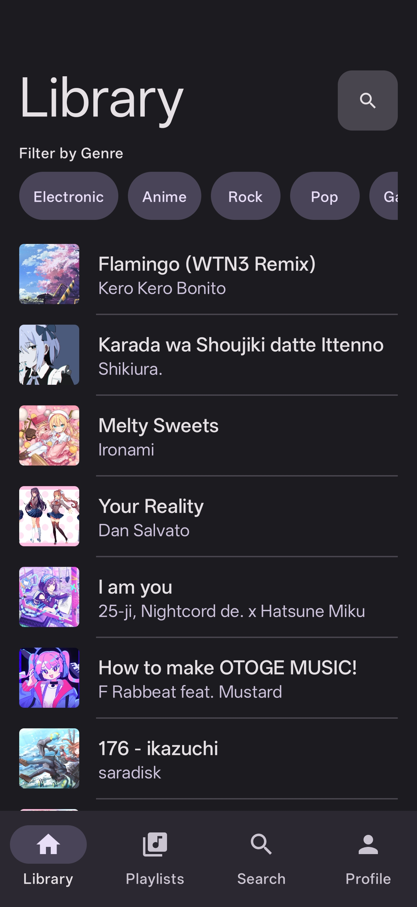
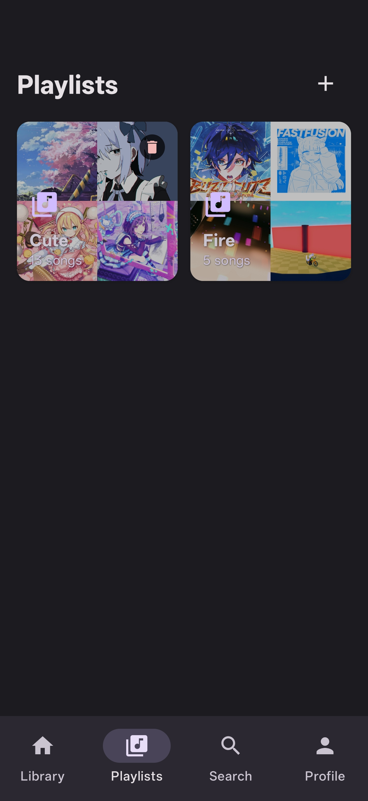
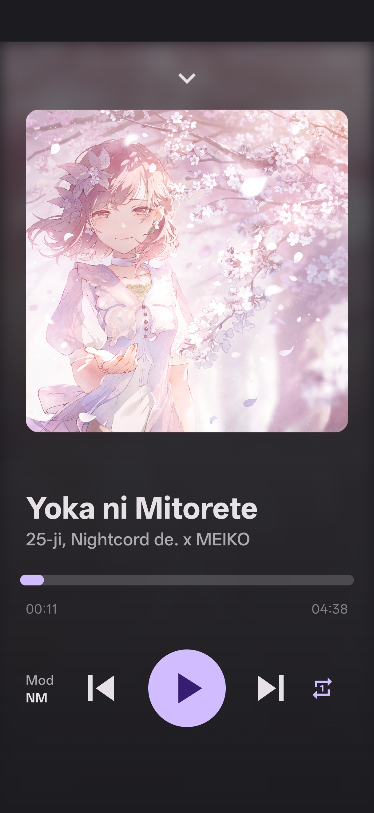
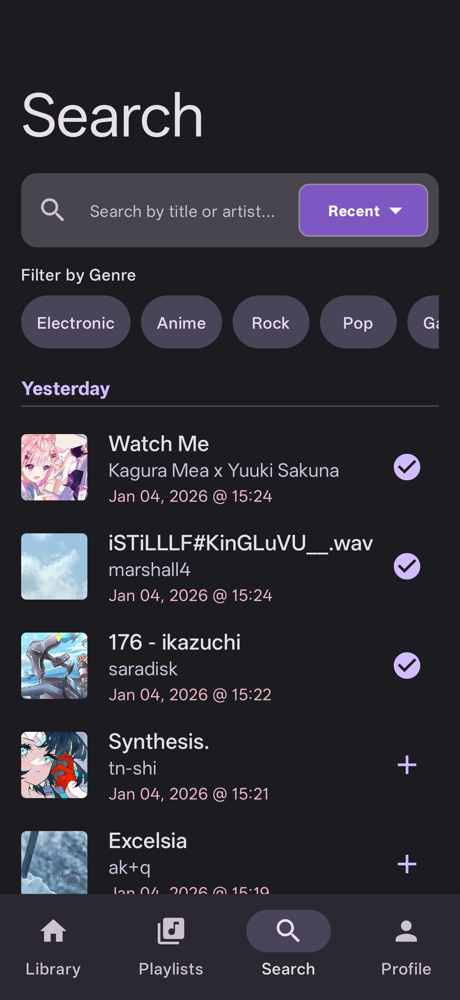
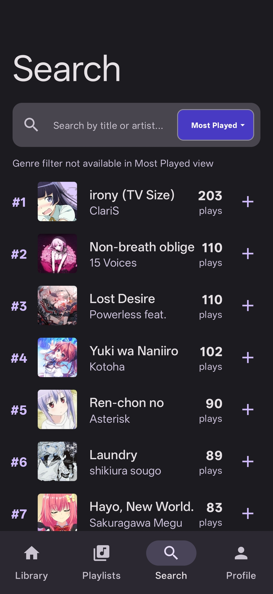
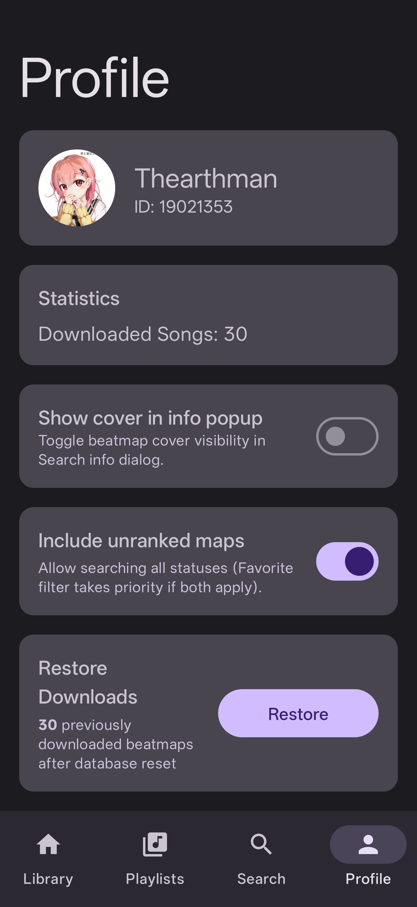

# Mosu — osu!-powered offline music player (Android)

**中文版**: [README_zh.md](README_zh.md)

## Introduction
Mosu lets you log in with your osu! account, fetch your played/favorite beatmaps, download them as songs, and play them offline with Media3/ExoPlayer. It uses mirrors for `.osz` downloads, extracts audio/cover art, and stores metadata in Room with cached search results for speed.

## Download
📥 **Latest Release**: [Download from GitHub Releases](https://github.com/Thearthman/mosu/releases/latest)

## UI and Page design

  
  
  
  
  
  

### Features
- OAuth login with automatic token refresh and credential management.
- Search views (selectable and persisted): Played, Recent (with timestamps), Favorite, Most Played, All; global "include unranked (s=any)" toggle in Profile.
- Advanced search: merge duplicate songs by title/author, enhanced info popups showing all matching beatmapsets from osu API (difficulties, star ratings, game modes), color-coded difficulty gradients, manual cache refresh (pull-to-refresh).
- Per-item download progress; downloaded items tap-to-play from Search/Library.
- Library with genre filter, search bar, and "Find current song" locator that scrolls/highlights the playing track; swipe-to-delete or add to playlists.
- Playlists: create custom playlists, add/remove songs, long-press to rename/delete playlists, playlist-specific playback modes.
- Player: background playback (Media3), collapsible MiniPlayer with controls, expandable full player view; mod selector (NM/DT/NC) with persistence, deterministic shuffle cycling, playback mode persistence (single/loop/random).
- Profile: user info, downloaded count, default search view setting, include-unranked toggle, OAuth credentials management, language selector following system locale.
- UI polish: Apple Music-inspired design, dark mode, gamemode icons in search results, individual difficulty titles in player, smooth animations, no divider lines.

## Setup Tutorial

### 1. Prerequisites
- An osu! account, from which you will need to get OAuth app credentials (client ID/secret) from https://osu.ppy.sh/home/account/edit. 

> **IMPORTANT**: How to get your OAuth keys:
> 1. Go to https://osu.ppy.sh/home/account/edit
> 2. Scroll down to find the "OAuth" (开放授权) section
> 3. Click "New OAuth Application"
> 4. Set **Application Callback URL** to exactly: `mosu://callback` (no trailing slash!)
> 5. Give your app a name (e.g., "Mosu")
> 6. Click "Register application"
> 7. Copy your **Client ID** and **Client Secret** (you'll need both) 

### 2. Configure OAuth (required to log in)
- Launch the app, go to Profile → Configure Credentials.
- Enter your osu! OAuth client ID and secret; they are stored locally via DataStore.
- Login will redirect via `mosu://callback` (already in the manifest).

### 3. Usage tips
- Search: choose view via dropdown (Played/Recent/Favorite/Most Played/All); genre chips; pull-to-refresh cache; long-press for enhanced beatmap info popup showing all matching beatmapsets with color-coded difficulty gradients; short-press to play downloaded songs.
- Library: genre filter; search bar; swipe left to delete, right to add to playlist; "Find current song" button (bottom-right) to scroll/highlight current track.
- Playlists: create custom playlists; long-press playlist to rename/delete; within playlists, swipe right to remove from playlist, left to delete from library.
- Player: tap MiniPlayer to expand; drag progress bar; cycle through playback modes (single/loop/random); Mod selector for DT/NC effects; mods persist across tracks.
- Profile: user info, downloaded count, default search view setting, include-unranked toggle, OAuth credentials management, language selector following system locale.

### 4. Notes
- Download source uses mirrors; audio/cover extracted from `.osz` and stored under app files. 
- Room DB version 5 with destructive migrations during development.
