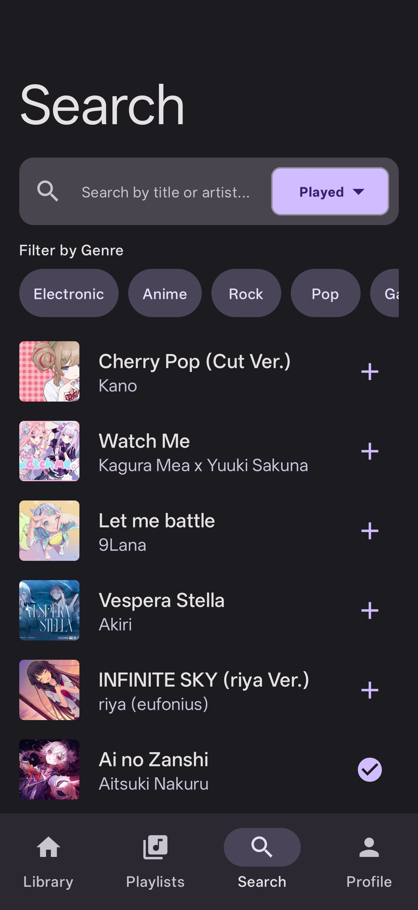
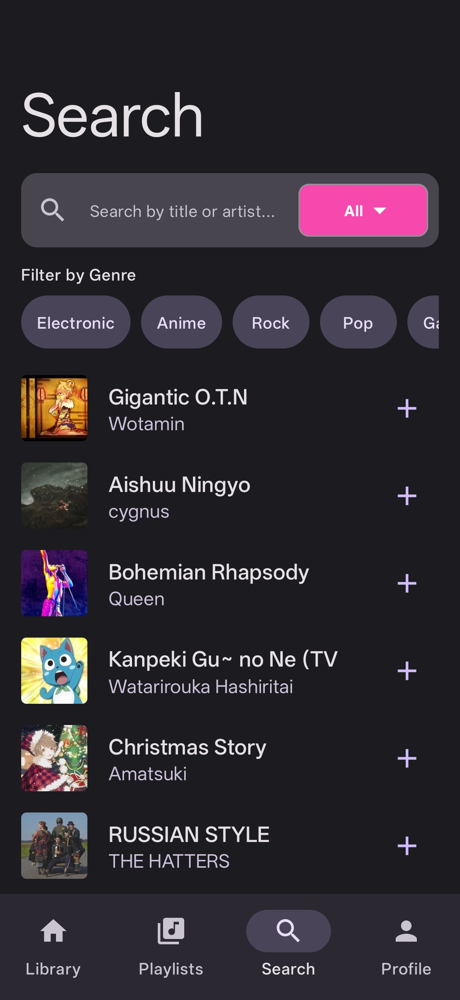

# Mosu — osu!-powered offline music player (Android) 

## Introduction
Mosu lets you log in with your osu! account, fetch your played/favorite beatmaps, download them as songs, and play them offline with Media3/ExoPlayer. It uses mirrors for `.osz` downloads, extracts audio/cover art, and stores metadata in Room with cached search results for speed.

## UI and Page design

  
  
  

  
  

### Features
- OAuth login with persisted tokens; in-app client ID/secret configuration.
- Search views (selectable and persisted): Played, Recent (cached), Favorite, Most Played, All; global “include unranked (s=any)” toggle in Profile.
- Per-item download progress; downloaded items tap-to-play from Search/Library.
- Library with genre filter and “Find current song” locator that scrolls/highlights the playing track; swipe-to-delete.
- Player: background playback (Media3), full player + MiniPlayer; mod selector (NM/DT/NC) with persistence, deterministic mode cycling; MiniPlayer hidden on Profile.
- Profile: user info, downloaded count, default search view setting, include-unranked toggle, OAuth credentials, language selector (global locale applied).
- UI polish: Apple Music-like nav, double-tap Search tab to scroll to top, no divider lines, new app icon.

## Setup Tutorial

### 1. Prerequisites
- An osu! account, from which you will need to get OAuth app credentials (client ID/secret) from https://osu.ppy.sh/home/account/edit. 

> **IMPORTANT**: How to get your OAuth keys:
> 1. Go to https://osu.ppy.sh/home/account/edit
> 2. Scroll down to find the "OAuth" (开放授权) section
> 3. Click "New OAuth Application"
> 4. Set **Application Callback URL** to exactly: `mosu://callback` (no trailing slash!)
> 5. Give your app a name (e.g., "Mosu")
> 6. Click "Register application"
> 7. Copy your **Client ID** and **Client Secret** (you'll need both) 

### 2. Configure OAuth (required to log in)
- Launch the app, go to Profile → Configure Credentials.
- Enter your osu! OAuth client ID and secret; they are stored locally via DataStore.
- Login will redirect via `mosu://callback` (already in the manifest).

### 3. Usage tips
- Search: choose view via dropdown; genre chips; load more; downloaded items show checkmarks and play instantly.
- Library: genre filter; swipe-to-delete; “Find current song” button (bottom-right) to scroll/highlight current track.
- Player: tap MiniPlayer to expand; Mod label to pick DT/NC; mod choice persists across tracks.
- Profile: set default search view, toggle include-unranked (s=any), language selection, view stats.

### 4. Notes
- Download source uses mirrors; audio/cover extracted from `.osz` and stored under app files. 
- Room DB version 5 with destructive migrations during development.
