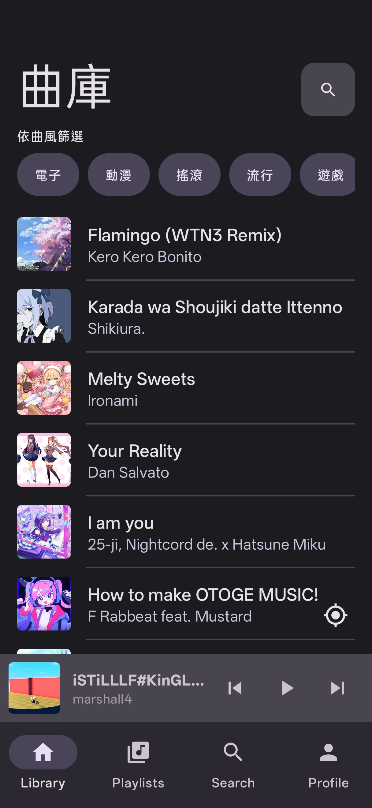
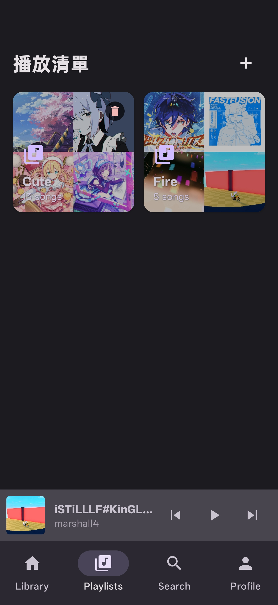
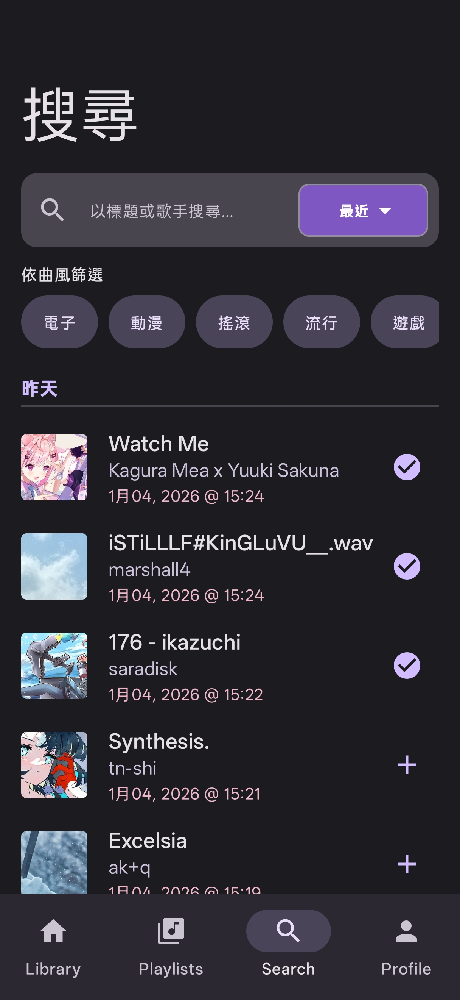
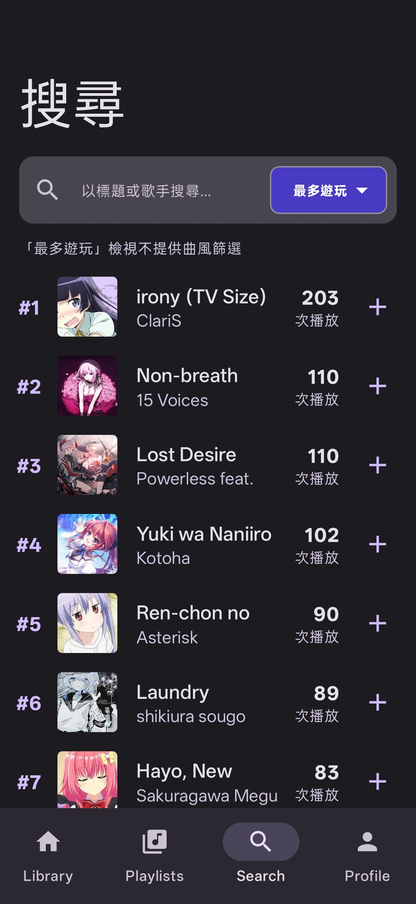
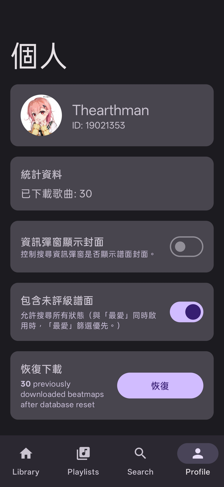

# Mosu — 基于 osu! 的离线音乐播放器 (Android)

## 简介
Mosu 允许您使用 osu! 账号登录，获取您玩过/收藏的谱面，将它们下载为歌曲，并使用 Media3/ExoPlayer 进行离线播放。它使用镜像源下载 `.osz` 文件，提取音频和封面艺术，并将元数据存储在 Room 数据库中，同时缓存搜索结果以提升速度。

## 下载
📥 **最新版本**: [从 GitHub Releases 下载](https://github.com/Thearthman/mosu/releases/latest)

## UI 和页面设计

  
  
  
  
  
  

### 功能特性
- OAuth 登录自动令牌刷新和凭据管理。
- 搜索视图（可选择并持久化）：已玩、最近（带时间戳）、收藏、最常玩、全部；在个人资料中全局"包含非排名 (s=any)"切换。
- 高级搜索：按标题/作者合并重复歌曲，增强信息弹窗显示来自 osu API 的所有匹配谱面集（包含难度、星级评分、游戏模式），使用颜色编码的难度梯度，支持手动缓存刷新（下拉刷新）。
- 逐项下载进度；搜索/曲库中下载的项目点击播放。
- 曲库带流派筛选器、搜索栏、"查找当前歌曲"定位器滚动/高亮播放曲目；滑动删除或添加到播放列表。
- 播放列表：创建自定义播放列表，添加/移除歌曲，长按重命名/删除播放列表，播放列表特定播放模式。
- 播放器：后台播放（Media3），可折叠 MiniPlayer 带控制，展开完整播放器视图；模组选择器（NM/DT/NC）带持久化，确定性随机播放循环，播放模式持久化（单曲/循环/随机）。
- 个人资料：用户信息，下载数量，默认搜索视图设置，包含非排名切换，OAuth 凭据管理，语言选择跟随系统语言环境。
- UI 打磨：受 Apple Music 启发的设计，深色模式，搜索结果中的游戏模式图标，播放器中的单独难度标题，流畅动画，无分割线。

## 设置教程

### 1. 前置条件
- 一个 osu! 账号，您需要从 https://osu.ppy.sh/home/account/edit 获取 OAuth 应用凭据（客户端 ID/密钥）。

> **重要**：如何获取您的 OAuth 密钥：
> 1. 前往 https://osu.ppy.sh/home/account/edit
> 2. 向下滚动找到 "OAuth" (开放授权) 部分
> 3. 点击 "New OAuth Application"
> 4. 将 **Application Callback URL** 设置为：`mosu://callback`（无尾随斜杠！）
> 5. 为您的应用命名（例如："Mosu"）
> 6. 点击 "Register application"
> 7. 复制您的 **Client ID** 和 **Client Secret**（两者都需要）

### 2. 配置 OAuth（登录必需）
- 启动应用，前往个人资料 → 配置凭据。
- 输入您的 osu! OAuth 客户端 ID 和密钥；它们通过 DataStore 本地存储。
- 登录将通过 `mosu://callback` 重定向（已在清单中配置）。

### 3. 使用提示
- 搜索：通过下拉菜单选择视图（已玩/最近/收藏/最常玩/全部）；流派标签；下拉刷新缓存；长按获取增强谱面信息弹窗，显示所有匹配谱面集并带颜色编码难度梯度；短按播放已下载歌曲。
- 曲库：流派筛选；搜索栏；左滑删除，右滑添加到播放列表；"查找当前歌曲"按钮（右下角）滚动/高亮当前曲目。
- 播放列表：创建自定义播放列表；长按播放列表重命名/删除；在播放列表中，右滑从播放列表移除，左滑从曲库删除。
- 播放器：点击 MiniPlayer 展开；拖拽进度条；循环播放模式（单曲/循环/随机）；DT/NC 效果模组选择器；模组跨曲目持久化。
- 个人资料：用户信息，下载数量，默认搜索视图设置，包含非排名切换，OAuth 凭据管理，语言选择跟随系统语言环境。

### 4. 注意事项
- 下载源使用镜像；音频/封面从 `.osz` 提取并存储在应用文件下。
- Room 数据库版本 5，开发期间使用破坏性迁移。
